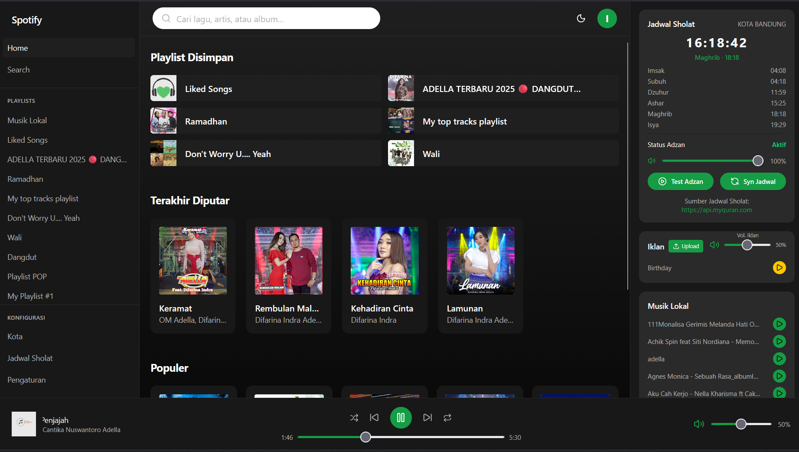
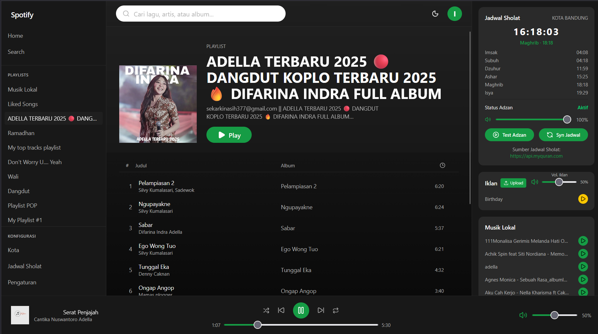
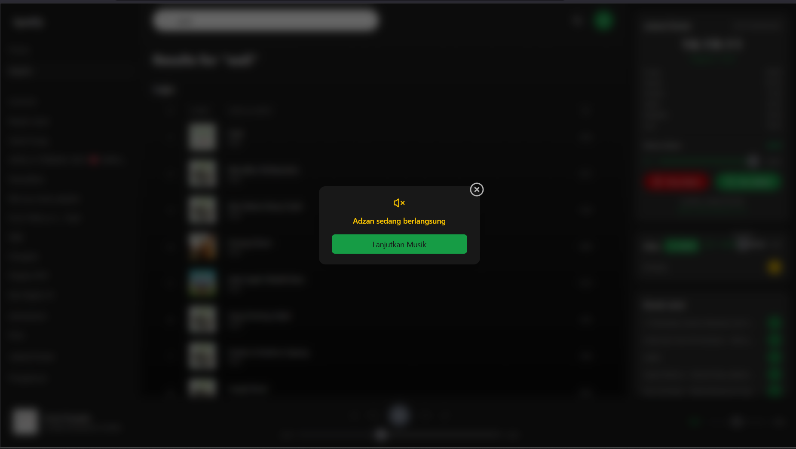
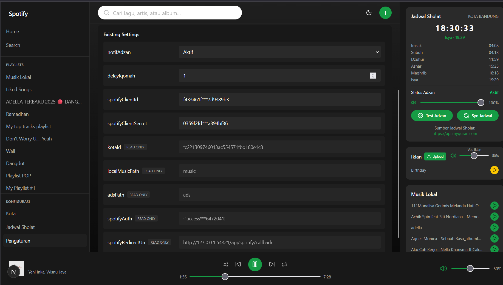

# Spotify Player

**Versi:** 2.0.0  
**Deskripsi:** Pemutar musik Spotify dengan dukungan audio lokal dan jadwal sholat.

---

## Fitur

- Putar musik dari Spotify (Premium required).
- Putar audio lokal (MP3, WAV) dengan dukungan queue.
- Toggle Play / Pause, Next / Prev, Shuffle, Repeat.
- Sinkronisasi posisi lagu (seek) untuk Spotify & local.
- Dukungan jadwal sholat: adzan & iqomah mem-pause playback otomatis.
- Notifikasi toast untuk error / info.

---

## Requirement

- Node.js v20+
- NPM / Yarn
- Spotify [Premium Standar](https://www.spotify.com/id-id/premium/#plans) account untuk fitur Spotify playback

---

## Instalasi

1. Clone repo:

```bash
git clone https://github.com/sejator/spotify-player.git
cd spotify-player
```

2. Install dependencies:

```bash
npm install
# atau
yarn install
```

3. Setup environment:

- Rename file `.env.example` menjadi `.env`

```text
DATABASE_URL="file:./db/spotify.db"
```

> Catatan: Credential Spotify (Client ID, Client Secret, Redirect URI) tidak disimpan di .env, tapi akan dimasukkan melalui menu Pengaturan di aplikasi setelah dijalankan.

### Spotify Setup (Wajib)

Sebelum menjalankan aplikasi, daftarkan URL callback di Spotify Developer Dashboard:

1. Buka Spotify Developer Dashboard
2. Buat aplikasi baru atau pilih aplikasi yang sudah ada
3. Pada kolom Redirect URIs, tambahkan:

```text
http://127.0.0.1:54321/api/spotify/callback
```

4. Ambil Client ID dan Client Secret dari dashboard.
5. Masukkan Client ID, Client Secret, dan Redirect URI di menu Pengaturan aplikasi nanti.
   > Tanpa langkah ini, login dan playback Spotify tidak akan berfungsi.

### Inisialisasi database SQLite (Prisma):

```bash
npx prisma migrate dev
npx prisma generate
npx prisma db seed
```

### Menjalankan Aplikasi

1. Jalankan server development:

```bash
npm run dev
# atau
yarn dev
```

2. Buka browser ke:

```bash
http://localhost:54321
# atau
http://127.0.0.1:54321
```

3. Login ke Spotify untuk mengaktifkan fitur playback Spotify.

### Skrip NPM

| Skrip                   | Deskripsi                                 |
| ----------------------- | ----------------------------------------- |
| `dev`                   | Jalankan Next.js dev server di port 54321 |
| `build`                 | Build project untuk production            |
| `start`                 | Jalankan server production                |
| `lint`                  | Jalankan ESLint                           |
| `prisma:migrate`        | Jalankan Prisma migrate dev               |
| `prisma:generate`       | Generate Prisma client                    |
| `prisma:seed`           | Seed database                             |
| `prisma:migrate:deploy` | Deploy migration ke DB                    |
| `prisma:studio`         | Buka Prisma Studio                        |

### API / Sumber Eksternal

- [Spotify Web Playback SDK](https://developer.spotify.com/documentation/web-playback-sdk) – untuk memutar musik dari Spotify
- [API Jadwal Sholat](https://api.myquran.com) – Digunakan untuk mengambil jadwal sholat harian, mem-pause playback otomatis saat adzan / iqomah

## Screenshots


<br/>

<br/>

<br/>

